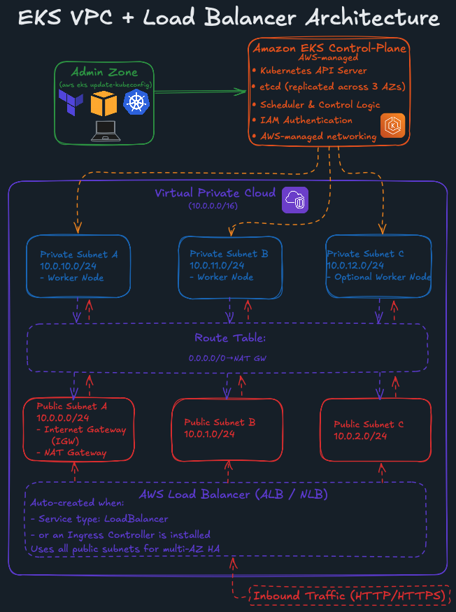

# AWS EKS Terraform

A minimal Terraform configuration for deploying an Amazon EKS cluster.  
It provisions a VPC, subnets, NAT gateway, EKS control plane, and a managed node group using official AWS modules.

*Figure 1: High-level architecture of the Amazon EKS cluster, including VPC layout, public/private subnets, NAT gateway, worker nodes, routing, and the internet-facing load balancer created for Kubernetes Service and Ingress resources.*

## What This Project Includes
- VPC with public and private subnets  
- EKS cluster (control plane + managed node group)  
- IAM roles and OIDC provider  
- Clean, modular Terraform structure  

## More Details
Full write-up on my portfolio website:  
[**https://daniellincu.dev**](https://daniellincu.dev/posts/7-terraform-aws-eks/)
